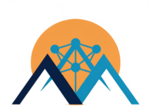

<p align="center">
  
</p>

# The Valley AI Club

**Learn AI. Build together. Serve the Valley.**

The Valley AI Club is a youth-led AI community for middle school and high school students across the San Fernando Valley. We provide a welcoming place to understand how AI works, build useful projects, and explore how technology can support local people and communities.

No coding or AI experience is required—curiosity is enough.

[Visit the website](https://valley-ai-club.github.io/) · [Join the club](https://forms.gle/at6Uc2pfSiB53pCx8)

## Who can participate

- Students in grades 6–12
- College students interested in mentoring
- Students at any experience level

## What we explore

### AI for Health & Data Science

Explore health data, prediction, and responsible AI to spot patterns and ask better questions.

### Coding, Simulation & Robotics

Learn programming by modeling real systems, testing ideas, and connecting code to the physical world.

### AI for the Valley Community & Environment

Build locally meaningful projects around community needs, the environment, and everyday life in the Valley.

## Planned activities

- **AI workshops:** friendly, hands-on introductions for students at any experience level
- **Datathons:** explore real datasets, form questions, and communicate discoveries
- **Hackathons:** design and build useful AI-powered projects in teams
- **Codathons:** practice programming through focused challenges and peer support

## Mentorship and community

The club is led by high school students and guided by UCLA faculty and student mentors with experience in Data Science and AI for Health education. We work in collaboration with CHEER.

> The Valley AI Club is a community initiative and does not represent an official UCLA program.

## About this website

This repository contains the club's static website, hosted with GitHub Pages.

```text
.
├── index.html          # Main website
├── assets/             # Styles, images, and fonts
├── .nojekyll           # Serves the site as static files
└── README.md
```

To preview the site locally:

```bash
python3 -m http.server 8000
```

Then open [http://localhost:8000](http://localhost:8000) in a browser. No build step is required.

## Get involved

Interested in learning, building, mentoring, or contributing?

- [Complete the interest form](https://forms.gle/at6Uc2pfSiB53pCx8)
- Email [sfvalleyaiclub@gmail.com](mailto:sfvalleyaiclub@gmail.com)
